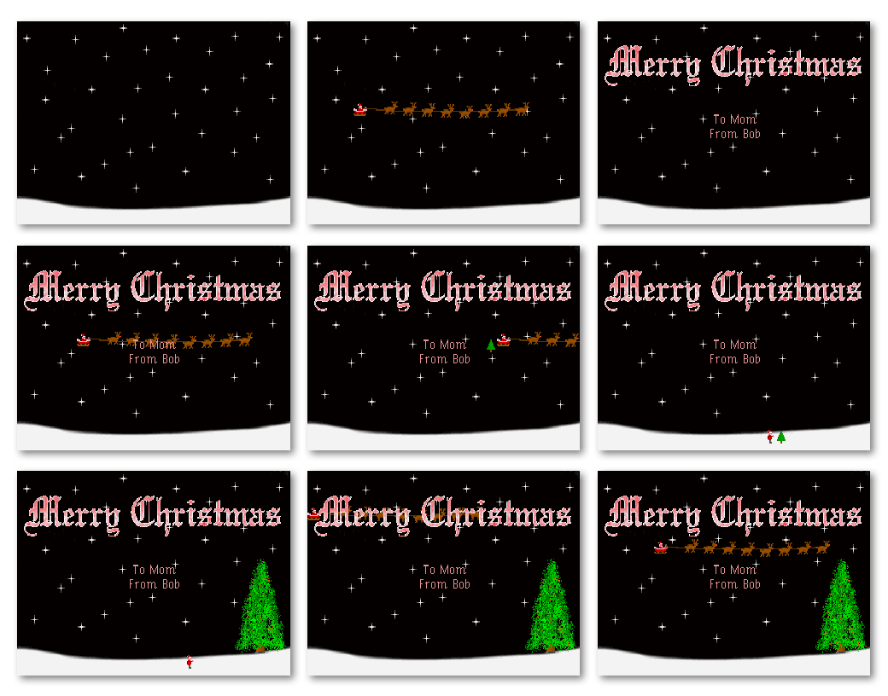

# xmas93 - A DOS Christmas Animation (1993)

This repository contains a Christmas animation I created on Christmas Eve 1993 using Borland C++ 3.1 on MS-DOS. It features a few animated scenes with Santa, Santa's sleigh, reindeer, a "Merry Christmas" message, and a tree.

I happened across it by accident today when looking through some old files and thought it would be fun to share.

## Background

On the afternoon of Christmas Eve in 1993, I decided to create a rudimentary one-off sprite emulation system from scratch, just for fun. I used it to make a virtual Christmas card for my mother, vaguely in the style of those old Commodore Christmas demos, and with artwork similar to Lemmings and other contemporary (at the time) MS-DOS games.

I created the assets and wrote the code in about an hour. Later that evening, I looked it over and made a couple minor tweaks. On Christmas afternoon, I made one final tweak to the large Christmas tree and the animation sequence.

It wasn't meant to be fantastic, but just cute and fun. The program runs in VGA mode 13h (320x200 pixels with 256 colors).

## Animation

The animation proceeds through several scenes, including:

- Santa and his reindeer flying across the night sky
- The "Merry Christmas" title appearing
- A personalized "To Mom From Bob" message appearing
- Santa delivering a Christmas tree from his sleigh
- Santa walking to the tree, giving a thumbs up, and making the tree grow in size dramatically
- Multiple passes of the sleigh at different heights, behind and in front of objects

# Screenshots



## Technical Details

`video.c` is a lightweight sprite engine for DOS. Despite being created in about an hour, it does provide functional sprite manipulation capabilities using VGA mode 13h (320x200 with 256 colors). It was written in Borland C++ 3.1 and runs in real mode DOS.

### Memory Management

The engine employs double buffering to ensure only complete frames are displayed. It uses two large memory buffers:

- `Page`: A 64KB far memory buffer that serves as the virtual screen
- `Back`: A 64KB far memory buffer that holds the background image

Both buffers are allocated using `farmalloc()` to access memory beyond the standard 64KB segment limitations of real mode DOS.

### Sprite Structure

Sprites are defined by the `SPRITE` structure which contains:
- `Buffer`: Pointer to the sprite's pixel data (allocated with `farmalloc()`)
- `x, y`: Current position coordinates
- `w, h`: Width and height dimensions
- `Shown`: Flag indicating if the sprite should be rendered (1) or not (0)

The engine supports up to 128 sprites simultaneously as defined by `MAXSPRITES`.

### Key Functions

#### Initialization
- `Init_Palette()`: Loads a 768-byte palette file (256 colors × 3 RGB components) directly to the VGA hardware
- `Init_Back()`: Loads the background image into memory
- `Init_Sprites()`: Initializes the sprite array and allocates the virtual screen buffer

#### Sprite Management
- `Load_Sprite()`: Loads a sprite from a file and returns its index
- `Next_Sprite()`: Finds the next available sprite slot
- `Activate_Sprite()` / `Deactivate_Sprite()`: Controls sprite visibility
- `Move_Sprite()`: Relative sprite movement
- `Move_Sprite_ABS()`: Absolute sprite positioning

#### Rendering
- `Show_Sprite()`: Renders a single sprite to the virtual screen with transparent pixels (value 0)
- `Update()`: Main rendering function that:
  1. Copies the background to the virtual screen
  2. Renders all active sprites to the virtual screen
  3. Copies the complete frame to the VGA memory at address 0xA000:0000

### Assembly Implementation

The sprite rendering uses inline assembly for performance:
- Sprites are rendered with transparency (pixels with value 0 are skipped)
- Clipping is implemented to handle sprites that extend beyond screen boundaries
- Direct memory addressing is used for efficient pixel manipulation

### File Format

Sprite files have a simple format described in the [CLB file format](#clb-file-format) section below. Essentially:

- The pixel data is stored at the beginning of the file
- The file ends with a "DIMS:" tag followed by four integers defining the sprite boundaries

### Limitations

- The engine assumes VGA mode 13h (320x200, 256 colors)
- Error handling is basic and terminates the program with an error message
- All sprites must fit in available conventional memory
- All `MAXSPRITES` sprites are checked for rendering every frame, even if they were never activated
- No provisions for multiple sprites sharing the same pixel data
- Simple transparency (color 0 is transparent)
- The entire screen is redrawn every frame
- No cleanup of allocated memory

## Repository Files

This repository contains the following key components:

### Assets (`assets` folder)
- `original` folder: `.gif` and `.rif` files - Original graphics used to create sprites
- `clb` folder: `.clb` and `.clp` files - Sprite data files

Note that the `.rif` files are from [Fractal Design Painter](https://en.wikipedia.org/wiki/Corel_Painter), which was the paint program I was using at the time. They can be opened with [Corel Painter](https://www.painterartist.com/en/).

### Build files (`build` folder)
- `.obj` files - Object files generated during compilation (Borland format)

### Distribution Files (`dist` folder)

This is the folder you want to run. It contains the following files:

- `xmas.exe` - The compiled executable (MS-DOS executable)
- `xmas.pal` - Color palette file
- `.clb` files - Sprite data (reindeer, Santa, tree, text, etc.)

## Screenshots (`sshots` folder)
- Screenshots of the animation in action (for use in this README)

### Source Code (`src` folder)
- `main.c` - Main program logic and animation sequences
- `video.c` - Sprite engine implementation
- `video.h` - Sprite engine header file with function declarations
- `xmas.prj` - Borland C++ project file

### `.clb` file format

The `.clb` files used here were exported from IMPROCES, a shareware paint program for MS-DOS.

They are in its "clipboard" format, which is a simple binary format with a text footer. The pixel data comes first, in raw binary format (i.e. each byte is a palette index of 0-255 for each pixel), followed by text indicating the dimensions of the image, in the format `DIMS: start_x start_y end_x end_y`, where the coordinates are integers representing where on the source image this file was saved from. The coordinates are inclusive, so if they read `DIMS: 0 0 63 31`, that means the image is 64x32 pixels.

Each `.clb` file also has a corresponding `.clp` file which contains the palette data. Those are 769-byte files, with a single header byte followed by 256 RGB triplets in VGA format (so 0-63 instead of 0-255), one byte per value.

Note that this program does *not* use those palette data files, as it uses the single 768-byte palette defined in `xmas.pal`. However, I have provided the original `.clp` files, along with copies of the `.clb` files, in the `assets/clb` folder.

To view `.clb` files, you can use my free [CLB Viewer](https://github.com/RobertSundling/clb-viewer) utility. You'd run it like this:

```bash
python clb_viewer.py assets/clb
```

(Note that you cannot view them directly from the `dist` folder because the corresponding `.clp` files are missing.)

## Building and Running

This program was designed for MS-DOS systems with a VGA graphics adapter. To run it today:

1. Use [DOSBox](https://www.dosbox.com/) or another DOS emulator
1. Mount the this repository as a virtual drive
1. Change into the `dist` directory and run `xmas.exe`
    ```
    cd dist
    xmas.exe
    ```

    Note that the program does not check for keypresses very often; if you press a key to terminate the program, it will wait until the current animation sequence is complete. Be patient.

To build from source with Borland C++ 3.1:
1. Change into the `src` directory
1. Load the `xmas.prj` project file in Borland C++
1. Compile the project

Note that the project file assumes Borland C++ was installed in `C:\BORLANDC` so you may need to adjust this for your system.

## License

This project is now available under the MIT License. See the LICENSE file for details.

## Contributing

As this is an archival project, contributions are not being sought and pull requests will not be accepted. However, feel free to fork the repository and make modifications for personal use.
